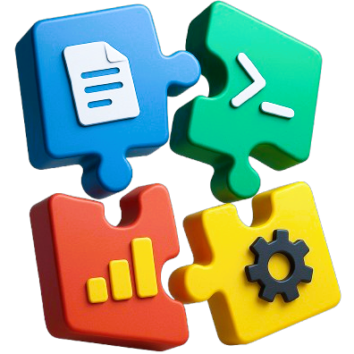

<div align="center">
  
  <h1 align="center">FlexiTools</h1>
  <p align="center">
    一個基於 Python Tkinter 的模組化桌面應用程式，提供可自由組合、拖曳、縮放的工具介面。
    <br>
    <a href="#核心功能">核心功能</a> •
    <a href="#模組介紹">模組介紹</a> •
    <a href="#安裝與執行">安裝與執行</a> •
    <a href="#使用教學">使用教學</a>
  </p>
</div>

---

## 📝 專案簡介

**FlexiTools** 是一個高度可自訂的桌面工具套件。它的核心理念是將不同的功能「模組化」，讓使用者可以像組合積木一樣，自由地在主視窗中新增、排列、縮放各種工具，並能儲存與載入個人化的版面配置。無論您是需要一個多功能的開發儀表板、一個數據分析工作區，或只是一個整合了常用小工具的桌面，FlexiTools 都能滿足您的需求。

## ✨ 核心功能

*   **模組化架構**: 每個工具都是一個獨立的模組，可以輕鬆新增或移除。
*   **動態版面配置**:
    *   **拖曳與放置**: 使用滑鼠拖曳模組的標題列，即可在視窗內自由移動和重新排列。
    *   **縮放**: 拖曳模組右下角的縮放手柄，可以自由調整每個工具視窗的大小。
    *   **最大化/還原**: 雙擊模組標題列，可以將其最大化至整個視窗，再次雙擊即可還原。
*   **版面配置管理**:
    *   **儲存配置**: 將您精心設計的版面配置儲存成 Profile，方便日後快速載入。
    *   **載入配置**: 隨時切換不同的工作區配置。
*   **狀態共享**: 模組之間可以共享狀態和數據（例如，日誌系統）。

## 🛠️ 模組介紹

FlexiTools 內建了多種實用工具模組，涵蓋了從開發、數據分析到日常應用的各種場景。

| 模組名稱 | 功能說明 |
| :--- | :--- |
| **Browser** | 一個輕量級的內嵌式網頁瀏覽器，基於 CEF (Chromium Embedded Framework)。 |
| **CAD File Converter** | 提供 GDS, DXF, DWG 等 CAD 檔案格式之間的互相轉換。整合了 `gdstk`, `ezdxf` 和 ODA File Converter。 |
| **Clock** | 一個簡單的數位時鐘，即時顯示目前時間。 |
| **Color Palette** | 一個色彩選擇器和調色盤工具，方便開發者或設計師取色、配色。 |
| **Drawing Pad** | 一個簡易的畫板，可以用不同顏色和寬度的畫筆自由塗鴉。 |
| **Fitter** | 用於擬合和分析共振器數據，提供數據載入、曲線擬合與視覺化圖表功能。 |
| **CMD Emulator** | 一個功能齊全的命令列模擬器，支援標準 CMD 指令，並深度整合了 Conda 環境的偵測與切換功能。 |
| **Image Editor** | 一個基礎的圖片編輯器，支援開啟、旋轉、裁剪、儲存圖片，並提供簡單的繪圖功能。 |
| **MP4 Processor** | MP4 影片處理工具，可以將影片轉換為圖片幀、提取音訊 (MP3/OGG) 或進行去背。 |
| **Notepad** | 一個簡單的純文字編輯器，支援開啟、編輯和儲存 `.txt` 檔案。 |
| **PDF Processor** | 提供 PDF 檔案的分割、合併、壓縮、添加浮水印和文字提取等多種功能。 |
| **Plot GUI** | 一個通用的數據繪圖工具，可以從 Excel 載入數據，並自訂 X/Y 軸的物理量和單位來繪製散點圖。 |
| **Recipe Wheel** | 一個有趣的食譜轉盤，隨機選擇一道菜並顯示其食材與做法，解決您的「今天吃什麼」煩惱。 |
| **Report** | 一個 Excel 檔案檢視器，可以載入 `.xlsx` 或 `.xls` 檔案並在表格中顯示其內容，支援多工作表切換。 |
| **Split Para** | 專為特定格式的 CSV 檔案設計的數據處理工具，可以根據參數將數據分割成多個檔案。 |
| **Sudoku Studio** | 一個數獨遊戲工作室，提供生成謎題、填寫、檢查答案等功能。 |
| **System Info** | 即時顯示您電腦的 CPU 和記憶體使用率。 |
| **Todo List** | 一個待辦事項清單，幫助您追蹤每日任務。 |
| **Unit Converter** | 一個單位換算工具，支援長度、溫度、重量等多種類型的單位轉換。 |
| **Video Player** | 一個影片播放器，支援播放清單、多種排序模式（時間、JSON、隨機），並內建 10 段音訊等化器。 |
| **YouTube Downloader** | 從 YouTube 下載影片或音訊，支援下載單一影片、整個播放清單，或播放清單中的指定項目。 |

## 🚀 安裝與執行

本專案建議使用 [Conda](https://docs.conda.io/en/latest/miniconda.html) 來管理環境與依賴項。

1.  **複製專案**:
    ```bash
    git clone https://github.com/jacky09299/FlexiTools.git
    cd FlexiTools
    ```

2.  **建立 Conda 環境**:
    `environment.yml` 檔案中包含了所有必要的依賴項。執行以下指令來建立環境：
    ```bash
    conda env create -f environment.yml -n <your-environment-name>
    ```

3.  **啟動環境**:
    ```bash
    conda activate <your-environment-name>
    ```

4.  **執行應用程式**:
    ```bash
    python main.py
    ```

## 📖 使用教學

1.  **啟動程式**: 執行 `python main.py` 後，會出現一個主視窗。
2.  **新增模組**:
    *   點擊頂部選單列的 `File` -> `Add Module`。
    *   從下拉選單中選擇您想新增的工具模組。
3.  **操作模組**:
    *   **移動**: 按住模組的標題列並拖曳。
    *   **縮放**: 按住模_modules/youtube_downloader.py組右下角的灰色小方塊並拖曳。
    *   **最大化/還原**: 雙擊標題列。
    *   **關閉**: 點擊標題列右側的 `X` 按鈕。
4.  **儲存/載入版面**:
    *   使用 `File` -> `Save Layout As...` 來儲存您目前的版面配置。
    *   使用 `File` -> `Load Layout` 來載入之前儲存的配置。

## 💻 技術棧

*   **核心框架**: Python 3, Tkinter
*   **主要依賴**:
    *   `PIL`
    *   `PyPDF2`
    *   `cProfile`
    *   `cefpython3`
    *   `concurrent`
    *   `ctypes`
    *   `cv2`
    *   `importlib`
    *   `io`
    *   `json`
    *   `lmfit`
    *   `logging`
    *   `matplotlib`
    *   `moviepy`
    *   `multiprocessing`
    *   `numpy`
    *   `openpyxl`
    *   `os`
    *   `packaging`
    *   `pandas`
    *   `pathlib`
    *   `pdfrw`
    *   `pstats`
    *   `psutil`
    *   `pygame`
    *   `pyroomacoustics`
    *   `queue`
    *   `random`
    *   `re`
    *   `rembg`
    *   `reportlab`
    *   `requests`
    *   `scipy`
    *   `shutil`
    *   `subprocess`
    *   `sys`
    *   `tempfile`
    *   `threading`
    *   `time`
    *   `tkinter`
    *   `traceback`
    *   `typing`
    *   `wave`
    *   `yt_dlp`
*   **環境管理**: Conda

---
<div align="center">
  <em>FlexiTools - 您的模組化桌面工作站</em>
</div>
